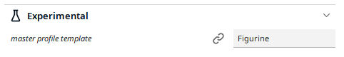

# Profile Plus

The plugin allows to delete parameters defined in a profile (Quality Change). 

**! Be careful, the change is immediate without any possibility to cancel the action !**

## Purpose of the plugin

There are often requests for the possibility of defining, for example, a ***Default printing temperature*** in the material definition and to avoid that the profile parameters overwrite this value. The problem is that the custom profile settings overwrite this data. The only solution I know is to edit the profile manualy via a text editor and delete the unnecessary parameter.

To avoid this issue, I've designed this Plugin to allows you to delete automaticaly in the active profile the parameters already defined in the material section of Cura. 

It also  allows you to delete in the active profile some parameters already defined. 

## Installation

#### Manually:
First, make sure your Cura version is  4.8 or newer.

[Download](https://github.com/5axes/ProfilePlus/archive/refs/heads/main.zip) or clone the repository into `[Cura configuration folder]/plugins/ProfilePlus`.

The configuration folder can be found via **Help** -> **Show Configuration Folder** inside Cura.

This menu opens the following folder:
* Windows: `%APPDATA%\cura\<Cura version>\`, (usually `C:\Users\<your username>\AppData\Roaming\cura\<Cura version>\`)
* Mac OS: `$HOME/Library/Application Support/cura/<Cura version>/`
* Linux: `$HOME/.local/share/cura/<Cura version>/`

## How to use

First of all you must activate the profile you want to edit.

Then use the function **Material Settings** to analyse the parameters of your profile then delete every parameters set in your current profile which are also present in the active Material settings.

The list of the  parameters  present in the profile and in your Material Settings will be displayed in this windows :

Then you can use the button :

- **Remove Parameters** : Delete every parameters set in your current profile which are also present in the active Material settings.
- **Remove Materials Parameters** : Delete every parameters set in your current profile which are also present in the generic Machine Materials Profiles associated with the current machine.
- **Link Parameters** : Link the settings present in the Material definition with your current settings by using the **extruderValueFromContainer** instruction.

The list of the suppressed parameters will be displayed in a Cura message :

**! Be careful, the deletion is direct without the possibility to cancel the action !** So it is highly recommende to duplicate your current Profile before to modify it with this plugin.

### Remove Settings

If you are an expert, you can also use the function **Remove Settings** to activate the windows where you will have every parameters set in your current profile.

Just uncheck the parameters you want to delete from the Profile and press the Button **Update current Profile parameters**

The list of the suppressed parameters will be displayed in a Cura message :

### Update from master profile template

Update the settings of your profile according to the parameters set in a Master Profile.  This Master Profile is defined in the parameter **Master Profile Template** in the **Experimental** section. of Cura.

### Analyse functions

- View Custom Parameters : View the parameters defined by the user.
- View Active Material : View the parameters defined in the material definition
- View Machine Materials : View the parameters defined in the default machine materials
- View Active Profile : View the parameters defined in the active profile
