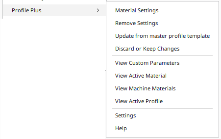

# Profile Plus

The plugin allows to delete parameters defined in a profile. 

**! Be careful, the deletion is direct without the possibility to cancel the action !**

## Purpose of the plugin

There are often requests for the possibility of defining, for example, a flow rate in the material definition. The problem is that the custom profile settings overwrite this data. The only solution I know is to edit the profile manualy via a text editor and delete the unnecessary parameter.

This Plugin allows you to delete in the active profile some parameters already defined. 

## Installation

#### Manually:
First, make sure your Cura version is  4.4 or newer.

Download or clone the repository into `[Cura configuration folder]/plugins/ProfilePlus`.

The configuration folder can be found via **Help** -> **Show Configuration Folder** inside Cura.

This menu opens the following folder:
* Windows: `%APPDATA%\cura\<Cura version>\`, (usually `C:\Users\<your username>\AppData\Roaming\cura\<Cura version>\`)
* Mac OS: `$HOME/Library/Application Support/cura/<Cura version>/`
* Linux: `$HOME/.local/share/cura/<Cura version>/`

## How to use

First of all you must activate the profile you want to edit.
Then use the function **Configure Settings** to activate the windows where you will have every parameters set in your current profile.

Just untick the parameters you want to delete from the Profile and press the Button **Update current Profile parameters**

The list of the suppressed parameters will be displayed in a Cura message :

